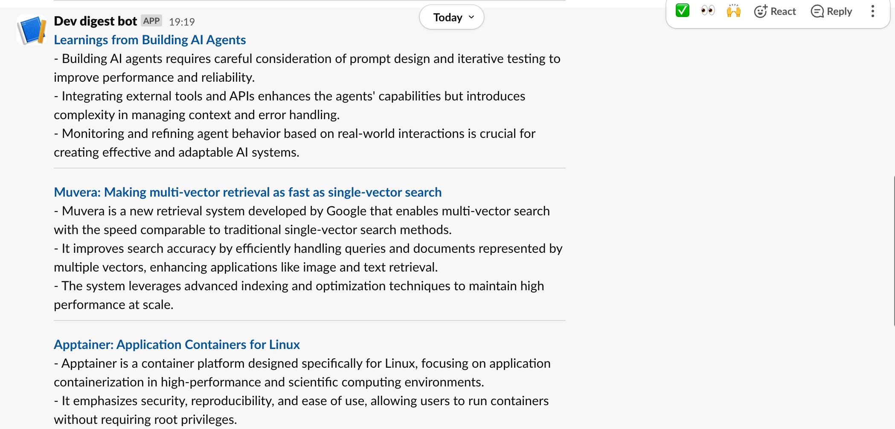

# DevBrief 📰

Your daily dose of developer news, without the noise.

**DevBrief** is an AI-powered serverless bot that fetches, summarizes, and delivers the top 5 dev articles from sources like Hacker News, GitHub Trending, and Medium. You get 2–3 bullet summaries delivered straight to Slack or email every morning — fully automated.

## 🛠️ Tech Stack

- **AWS Lambda** (Python 3.10) — Serverless compute for each stage
- **Amazon EventBridge (CloudWatch Events)** — Daily trigger
- **AWS Secrets Manager** — Secure API key storage
- **Amazon SES / Slack Webhook** — Delivery mechanisms
- **OpenAI / Gemini API** — Article summarization
- **GitHub Actions (Optional)** — CI/CD deployment

## 🧱 Architecture Overview

1. **Fetch & Parse**  
   Daily, a Lambda function scrapes RSS feeds and extracts titles, links, and snippets.

2. **Summarize**  
   The extracted items are passed to another Lambda, which uses OpenAI or Gemini API to generate concise summaries.

3. **Deliver**  
   A third Lambda sends the TL;DR as an email via Amazon SES or as a Slack message.

4. **Orchestration**  
   Scheduled with EventBridge. Can optionally use AWS Step Functions for chaining and error handling.
## 🤖 How It Works

1. ⏰ Every morning, AWS EventBridge wakes up the bot.
2. 🌐 It fetches top articles from RSS feeds.
3. 🧠 OpenAI/Gemini summarizes each into 2–3 bullet points.
4. 📩 The summaries are delivered via Slack or email.

[Click here for a full explanation](#step-5--orchestration--scheduling-explained-simply)

## 🚀 Getting Started

1. Clone this repo and add your own `feeds.json`
2. Store your API key securely in AWS Secrets Manager
3. Deploy each Lambda function via AWS Console or CLI
4. Set up Step Functions and scheduling using the provided templates

## 📸 Demo

Here’s what your daily digest looks like in Slack:

## Step 5 – Orchestration & Scheduling (Explained Simply)

This step is where all the moving parts of our Daily Dev Digest Bot come together like clockwork.  
Think of this like setting up a relay race: each runner (or function) passes the baton (data) to the next smoothly, without you lifting a finger.

### 🧠 What’s Happening Under the Hood

Every day, this bot runs in three big stages:

1. **Fetch**  
   It starts by grabbing the latest articles from your favorite tech news sources (like Hacker News or Medium).

2. **Summarize**  
   Then, it reads those articles and asks a smart AI model (GPT-4.1 Mini) to summarize them in 2–3 bullet points.

3. **Deliver**  
   Lastly, it sends those bullet-point summaries to your Slack channel or email inbox—like a personal tech briefing.

But how do we get these three steps to run in order, every single day?

### 🔄 Enter AWS Step Functions

We use a service called **AWS Step Functions**. This is like a digital flowchart that tells each function when to run and in what order.

Here’s how we set it up:

- **Start** → This is the trigger point that begins the process.
- **FetchArticles** → Calls the fetch function to get article titles and links.
- **SummarizeArticles** → Passes that info to the summarizer Lambda.
- **DeliverDigest** → Sends the final summaries via Slack or email.

Each step depends on the success of the one before it. If anything fails, AWS shows where it stopped so you can fix it easily.

### ⏰ Daily Scheduling with CloudWatch

To automate it every day:

- We use **Amazon EventBridge** (CloudWatch Events) to trigger the Step Function.
- It’s like setting a repeating alarm clock that starts your bot each morning.

### 🧪 Logs & Debugging

Want to check if it worked? You can:

- View step-by-step progress in AWS Step Functions
- Check CloudWatch Logs for each Lambda’s output
- Rerun failed steps without restarting the whole thing

---

✅ Once this is set up, your bot runs like a self-driving car:  
Always on time, zero effort, fully automated.

## 📝 License

MIT — free to use, modify, and share.

